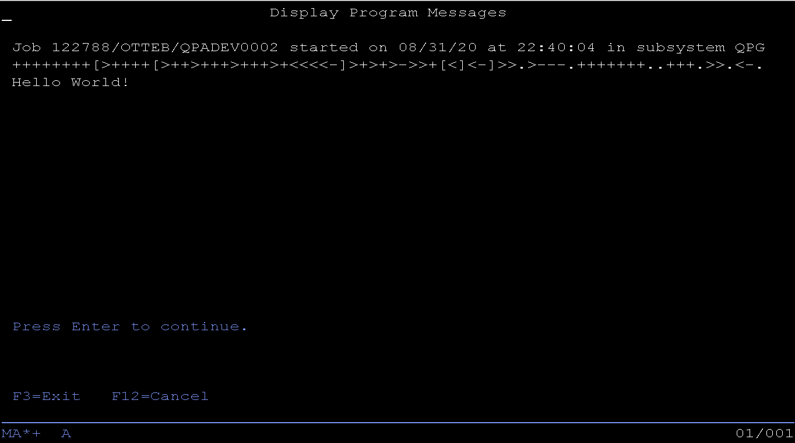

# RPGLE-BF
A crude BF interpreter in RPGLE. 

My only goal was to get "Hello World!" displayed from a BF program. This "interpreter" will definitely break on complex BF programs.





## Setup
* clone - ```git -c http.sslVerify=false clone https://github.com/barrettotte/RPGLE-BF.git```
* build - ```cd RPGLE-BF; chmod u+x build.sh; ./build.sh```


## Testing
* BF Hello world - ```BF IFSPATH('/home/OTTEB/RPG-BF/test/hello.bf')```


## Objects
* BF.CMD - Command wrapper over BF CL
* BF.CLLE - Invokes BF interpreter with file contents from IFS
* BFINT.RPGLE - BF interpreter, returns an output buffer.
* IFSREAD.RPGLE - Read file contents from IFS


## Commands
* build - ```./build.sh```
* git push - ```git -c http.sslVerify=false push origin master```


## References
* Prior BF interpreter I wrote in Groovy - https://github.com/barrettotte/Groovy-BF
